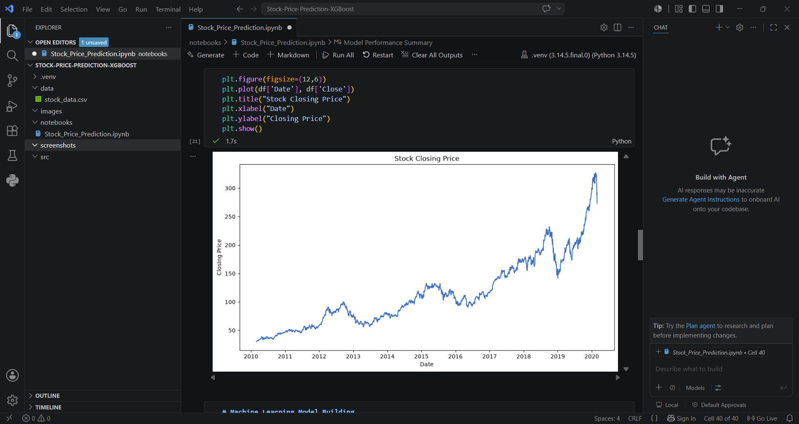
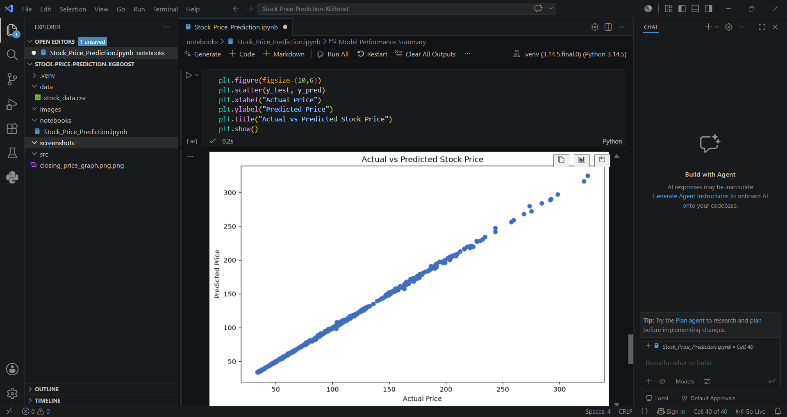
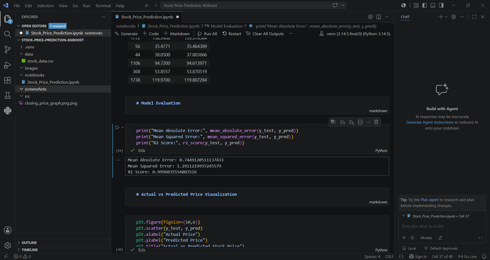

# 📈 Stock Price Prediction using Machine Learning

## 📌 Project Overview

This project predicts stock closing prices using the **Linear Regression** Machine Learning algorithm. Historical stock market data is cleaned, analyzed, and used to train a predictive model. The project includes data preprocessing, exploratory data analysis (EDA), visualization, model training, prediction, and performance evaluation.

---

## 🚀 Features

* Load historical stock market dataset
* Perform data cleaning and preprocessing
* Convert date and numerical data types
* Visualize stock closing prices
* Build a Linear Regression model
* Predict stock closing prices
* Evaluate model performance using MAE, MSE, and R² Score
* Compare Actual vs Predicted prices using visualization

---

## 🛠️ Technologies Used

* Python
* Pandas
* NumPy
* Matplotlib
* Scikit-learn
* Jupyter Notebook

---

## 📂 Dataset

The project uses a historical stock market dataset containing the following columns:

* Date
* Open
* High
* Low
* Close
* Volume

---

## 🔄 Project Workflow

1. Import Libraries
2. Load Dataset
3. Data Understanding
4. Data Cleaning
5. Exploratory Data Analysis (EDA)
6. Feature Selection
7. Train-Test Split
8. Model Training using Linear Regression
9. Stock Price Prediction
10. Model Evaluation
11. Data Visualization

---

## 📊 Model Performance

| Metric                    |      Value |
| ------------------------- | ---------: |
| Mean Absolute Error (MAE) | **0.7449** |
| Mean Squared Error (MSE)  | **1.2911** |
| R² Score                  | **0.9996** |

### Conclusion

The Linear Regression model achieved excellent performance in predicting stock closing prices. The low error values and high R² score indicate that the model accurately captures the relationship between the selected features and the closing price.

---

## 📷 Project Screenshots

### Dataset Preview


### Stock Closing Price



### Actual vs Predicted Price



### Model Evaluation



---

## ▶️ How to Run the Project

1. Clone this repository.
2. Install the required libraries:

```bash
pip install -r requirements.txt
```

3. Open the notebook:

   * `notebooks/stock_price_prediction.ipynb`
4. Run all cells from top to bottom.

---

## 📁 Project Structure

```text
Stock-Price-Prediction/
│
├── data/
│   └── stock_data.csv
│
├── notebooks/
│   └── stock_price_prediction.ipynb
│
├── screenshots/
│   ├── dataset_preview.png
│   ├── closing_price_graph.png
│   ├── actual_vs_predicted.png
│   └── model_evaluation.png
│
├── README.md
├── requirements.txt
```

---

## 🔮 Future Improvements

* Support live stock market data using APIs.
* Add multiple machine learning algorithms for comparison.
* Build an interactive web application using Streamlit.
* Improve prediction accuracy using advanced models such as LSTM.

---

## 👩‍💻 Author

**Manisha Tyagi**

Aspiring Data Analyst | Python | SQL | Excel | Power BI | Machine Learning
